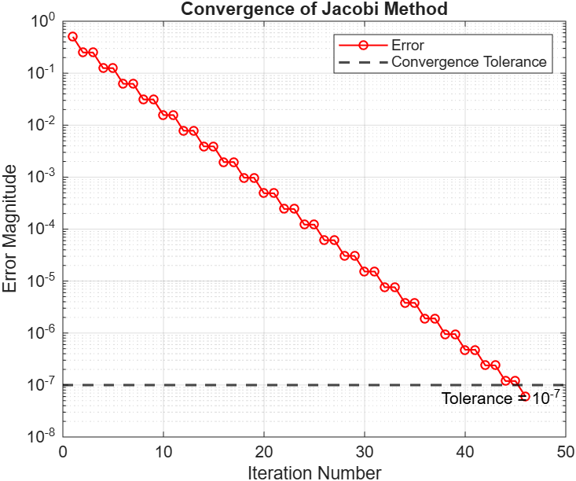

# Discretization of the 1D Diffusion (Laplace) Equation

This MATLAB code implements the Jacobi iterative method to solve the 1D Laplace equation using the finite difference method, with a convergence tolerance of 10^-7.

## Problem definition

The differential equation:

d²y/dx² = 0,  for 0 ≤ x ≤ 1

Subject to the boundary conditions:

y(0) = 0,  y(1) = 1

## Files

- `Solution of 1D Laplace equation.m` — MATLAB script that sets up the 1D mesh, applies Dirichlet boundary conditions, performs Jacobi iterations until the error is below 1e-7, and plots/summarizes results.
- `Convergence.png` — Convergence plot (error vs iteration).
- `Exact Vs Numerical solution.png` — Comparison plot of the exact analytical solution versus the Jacobi numerical solution.

## How to use

1. Open MATLAB (or GNU Octave with mostly compatible behavior).
2. Open `Solution of 1D Laplace equation.m` and run the script.

The script prints the iteration count and final error, displays the numerical solution, and plots two figures:
- Convergence of the Jacobi method (error magnitude vs iteration).
- Exact solution vs Jacobi numerical solution.

If you want to save the plots from the script automatically, add these lines after each figure block, for example:

```matlab
% After convergence plot
saveas(gcf, 'Convergence.png')

% After exact vs numerical plot
saveas(gcf, 'Exact Vs Numerical solution.png')
```

## Parameters

- Grid points: currently set to 5 (change `n_points` in the script for finer/coarser discretization).
- Convergence tolerance: 1e-7.
- Maximum iterations: adjustable in the script.

## How it works

- Uses the finite difference method to discretize the differential equation.
- Applies the Jacobi iterative method to solve the resulting linear system.
- Iterates until convergence or the maximum number of iterations is reached.
- Returns the solution at all grid points.

## Results (MATLAB run)

This section shows the actual output produced by running `Solution of 1D Laplace equation.m` with the default settings (n_points = 5):

```
Number of iterations = 46
Final error = 5.9604644775e-08
Numerical solution:
         0    0.2500    0.5000    0.7500    1.0000


Comparison of solutions:
       x       Y_Exact   Y_Numerical        Error
    0.00      0.000000      0.000000        0.000000e+00
    0.25      0.250000      0.250000        5.960464e-08
    0.50      0.500000      0.500000        5.960464e-08
    0.75      0.750000      0.750000        5.960464e-08
    1.00      1.000000      1.000000        0.000000e+00

Maximum absolute error = 5.9604644775e-08
```

### Nodal values (mesh points)

x = [0, 0.25, 0.5, 0.75, 1.0]

y_exact = [0, 0.25, 0.5, 0.75, 1.0]

y_numerical = [0, 0.25, 0.5, 0.75, 1.0]

Maximum absolute error: 5.9604644775e-08

## Plots

Convergence plot (error magnitude vs iteration):



Exact solution vs Jacobi numerical solution:


## Notes and suggestions

- The Jacobi method converges to the analytic linear profile y(x)=x. With larger `n_points` the number of iterations to reach the same tolerance grows — consider Gauss-Seidel, Successive Over-Relaxation (SOR), or direct solvers for faster convergence.
- To reproduce the saved PNGs automatically, add `saveas` calls (examples above) to the script.

If you want, I can also:
- Add an automated script to run for multiple grid sizes and save convergence-rate data, or
- Modify the script to save figures automatically and commit the generated PNGs.
