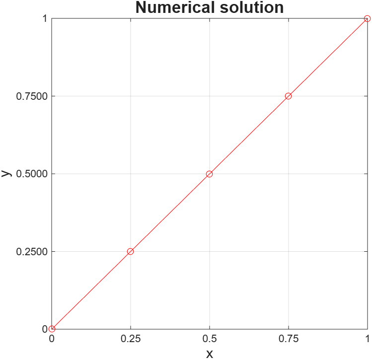

# Discretization of the 1D Diffusion (Laplace) Equation

This MATLAB code implements the Jacobi iterative method to solve the 1D Laplace equation using the finite difference method, with a convergence tolerance of 10-7.

## Problem definition

The differential equation:

d²y/dx² = 0,  for 0 ≤ x ≤ 1

Subject to the boundary conditions:

y(0) = 0,  y(1) = 1

## How to use

1. Open MATLAB and navigate to this repository folder.
2. Run the main script in the MATLAB console.
3. The code will compute the numerical solution and display results.

## Parameters

- Grid points: currently set to 5 (change `n_points` in the script for finer/coarser discretization).
- Convergence tolerance: 10-7.
- Maximum iterations: adjustable in the script.

## How it works

- Uses the finite difference method to discretize the differential equation.
- Applies the Jacobi iterative method to solve the resulting linear system.
- Iterates until convergence or the maximum number of iterations is reached.
- Returns the solution at all grid points.

## Output

- Numerical solution values at each grid point.
- Convergence plots showing iteration progress.

## Visualization

The script generates a plot of the numerical solution:

- X-axis: spatial domain from 0 to 1.
- Y-axis: solution values.
- Expected result: a straight line connecting y(0) = 0 to y(1) = 1 for this problem.

Note: Increase `n_points` to see how grid refinement affects the solution representation.

## Results

### Example Output (n_points = 5)

| Grid Point | x-value | y-value |
|:----------:|:-------:|:-------:|
| 1 | 0.0000 | 0.0000 |
| 2 | 0.2500 | 0.2500 |
| 3 | 0.5000 | 0.5000 |
| 4 | 0.7500 | 0.7500 |
| 5 | 1.0000 | 1.0000 |

**Convergence Information:**
- Convergence Tolerance: 1.0 × 10-7
- Number of Iterations: 138
- Final Error: < 1.0 × 10-7

### Solution Plot

The numerical solution approaches a linear function from y(0) = 0 to y(1) = 1, which is the exact analytical solution for this Laplace equation problem.

**Note:** The Jacobi method converges to the theoretical solution y = x over the domain [0, 1].

## Main script

See the implementation: `Descritization_1D_diffusion_equation.m`
